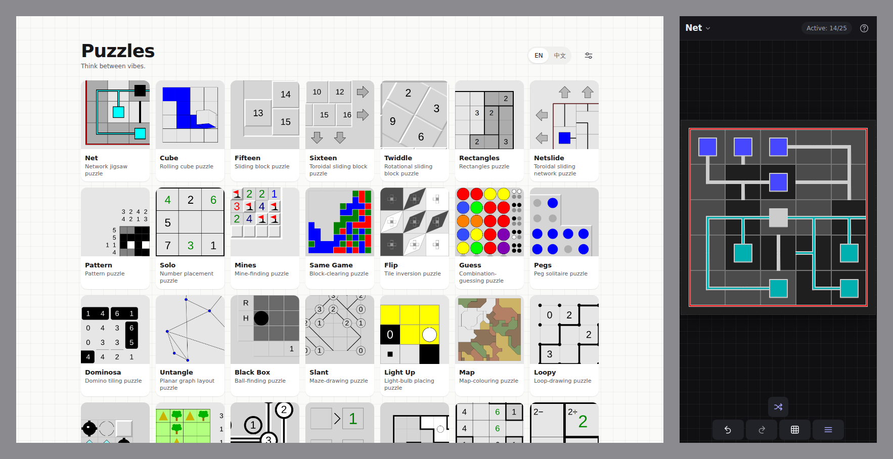

# Puzzles

Simon Tatham 的四十个谜题，做成了一个网页应用。手机上可以装到主屏幕，断网也能玩。

**<https://puzzles.ebnbin.dev/>**

> Think between vibes.



## 能做什么

- 四十个逻辑谜题：Net、Solo、Mines、Bridges、Loopy……
- 随手关掉，回来还是上次那一局
- 深色模式，棋盘跟着一起变
- 界面和完整手册都有中文
- 可以装到主屏幕，像个独立应用一样打开
- 不用注册，不联网，进度只在你自己的浏览器里

## 关于 vibe coding

这个项目是纯 vibe coding 的产物。除了上游那些 C 代码，这里的每一行都是和模型对话写出来
的：界面、构建脚本、深色调色板、中文翻译，以及你正在读的这份 README。

上面那句 tagline 就是这么来的。vibe coding 的大半时间是在等模型干活，而等的时候脑子是
空着的——这四十个谜题，就是拿来填那段空的。

## 开发

```bash
npm install
npm run dev
```

打包：

```bash
npm run build      # 类型检查 + 校验，产物在 dist/
npm run preview    # 预览 dist/
```

没有测试框架，也没有 linter，`npm run build` 就是全部的自动检查。动过手册的话再跑一次
`npm run verify-doc`（需要 halibut）。

| 路径 | 是什么 |
| --- | --- |
| `src/` | 界面 |
| `src/pages/` | 三个页面各一个包:画廊(gallery)、谜题(puzzle)、手册(manual) |
| `src/games/` | 统一游戏接口:一个游戏一个文件,外加看不见游戏的共享机器 |
| `src/ui/` | 语义通用的界面部件:对话框、sheet、通知、图标这些,不含谜题领域 |
| `src/engine/` | C 与界面之间的那层契约 |
| `vendor/sgtpuzzles/` | 上游源码，未经修改 |
| `public/` | 编译好的 wasm、手册、图片 |
| `scripts/` | 构建脚本 |

wasm、手册、缩略图这些产物都已经提交进仓库，日常开发不用重新生成。真要重新生成，步骤
和依赖在 [CLAUDE.md](CLAUDE.md)。

## 许可与致谢

谜题本身是 Simon Tatham 和众多贡献者的作品，以 MIT 许可证发布，见
[`vendor/sgtpuzzles/LICENCE`](vendor/sgtpuzzles/LICENCE)。上游主页：
<https://www.chiark.greenend.org.uk/~sgtatham/puzzles/>

外面这层界面同样是 MIT，见 [`LICENCE`](LICENCE)。
